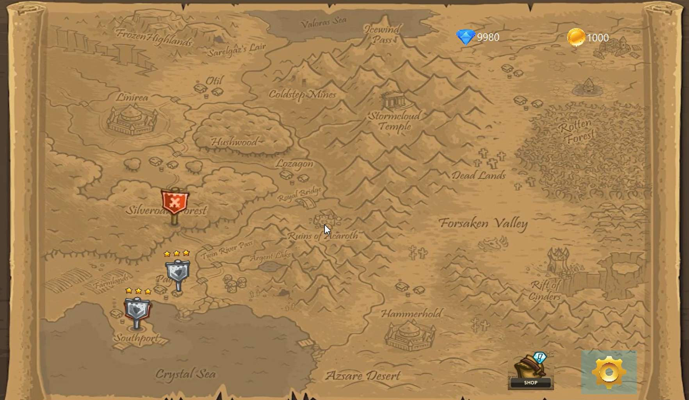

# Tower Defense Game

## Overview
This is a Tower Defense game developed in Java and JavaFX. Inspired by games like *Kingdom Rush*, players strategically place towers to defend their territory from waves of invading raiders. Players can build, upgrade, and remove towers, as well as use spells to aid in their defense.

## Features
- **Multiple Pages:**
  - **Start Page:** Includes options for login, registration, and settings.
  - **Shop Page:** Players can purchase towers and spells using in-game currency.
  - **Map Page:** Displays different levels that the player can access and progress through.
  - **Game Page:** Where the action takes place, including raiders, towers, and spells.
- **Tower Mechanics:** Players can place towers on designated spots, upgrade them, and remove them.
- **Raider Mechanics:** Various types of enemy units attack in waves, each with unique abilities.
- **Spells:** Special abilities to assist the player, such as freezing raiders or granting extra coins.

## Towers
- **Archer Tower:** Attacks one enemy at a time, dealing ranged damage. Reduced effectiveness against shielded raiders.
- **Wizard Tower:** Similar to the Archer Tower but has the ability to break shields.
- **Mortar Tower:** Deals area damage, effective against grouped enemies.
- **Barracks Tower:** Deploys soldiers to block and attack raiders on the path.

## Raiders
- **Basic Raider:** Standard enemy with no special abilities.
- **Flying Raider:** Immune to ground-based attacks.
- **Shielded Raider:** Reduces incoming damage.
- **Siege Raider:** Can attack and destroy towers.

## Spells
- **Heal:** Restores the player's health.
- **Freeze:** Temporarily stops all raiders on the path.
- **Gold Boost:** Grants additional in-game currency.
- **Firestorm:** Destroys all raiders in a certain area.

## Gameplay
1. Players start by selecting a level from the **Map Page**.
2. The game begins with a set amount of coins.
3. Players place towers strategically to defend against raiders.
4. Waves of raiders attack, and towers automatically engage them.
5. Players can use spells for additional support.
6. The game ends when either all waves are defeated (win) or the player's health reaches zero (loss).

## Installation
To run the game, ensure you have:
- Java installed (JDK 11 or higher).
- JavaFX library configured.
- Clone or download the project and execute the main class.

## Controls
- **Click on a tower slot** to build a tower.
- **Click on an existing tower** to upgrade or remove it.
- **Use spell buttons** to activate abilities during gameplay.

Enjoy defending your kingdom!

## Screenshots

### Start Page

### Login Page

### Map Page

### Shop Page

### Game Page
##### raiders

##### tower control

##### spell control

## Author
[MaryamDar](https://github.com/marydar)
